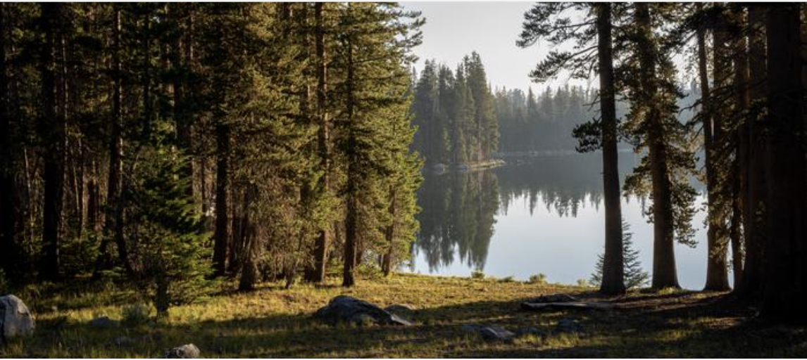
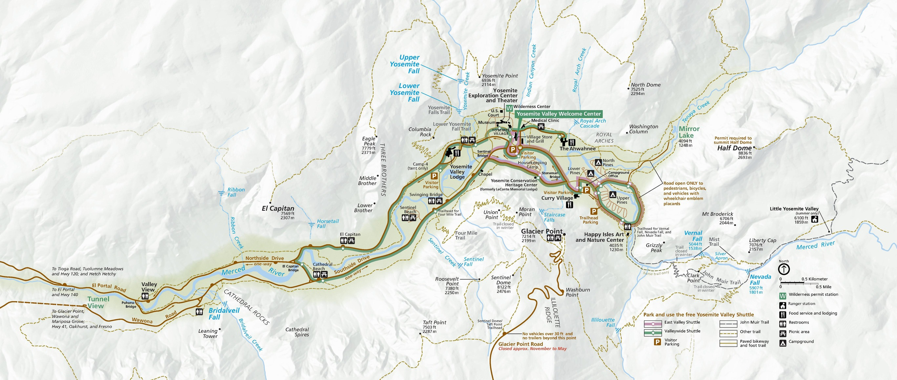
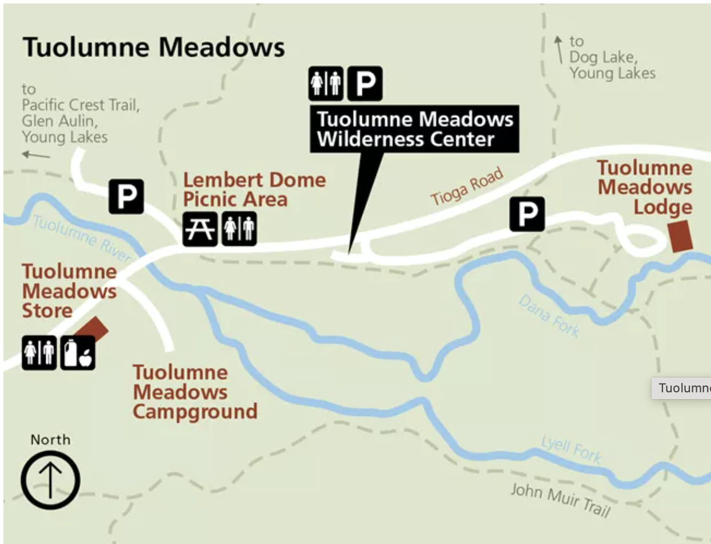
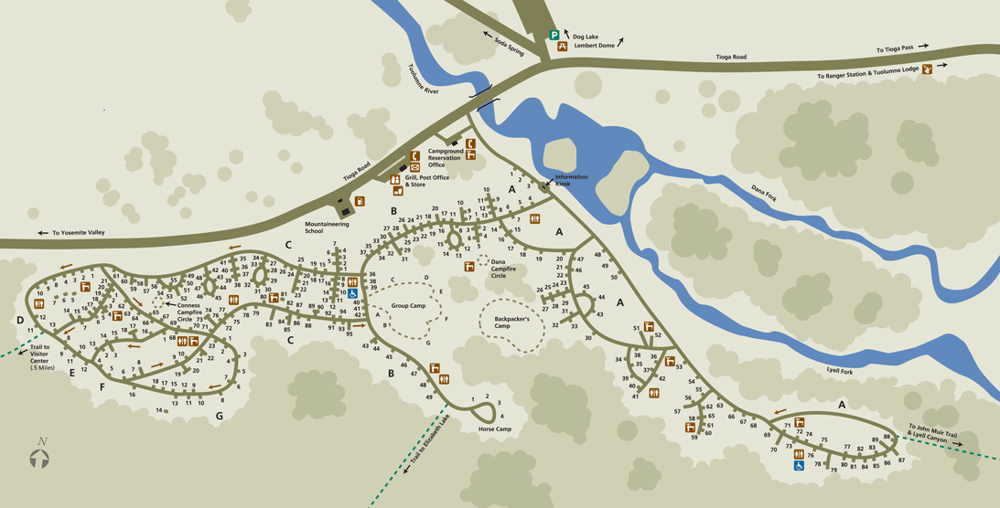
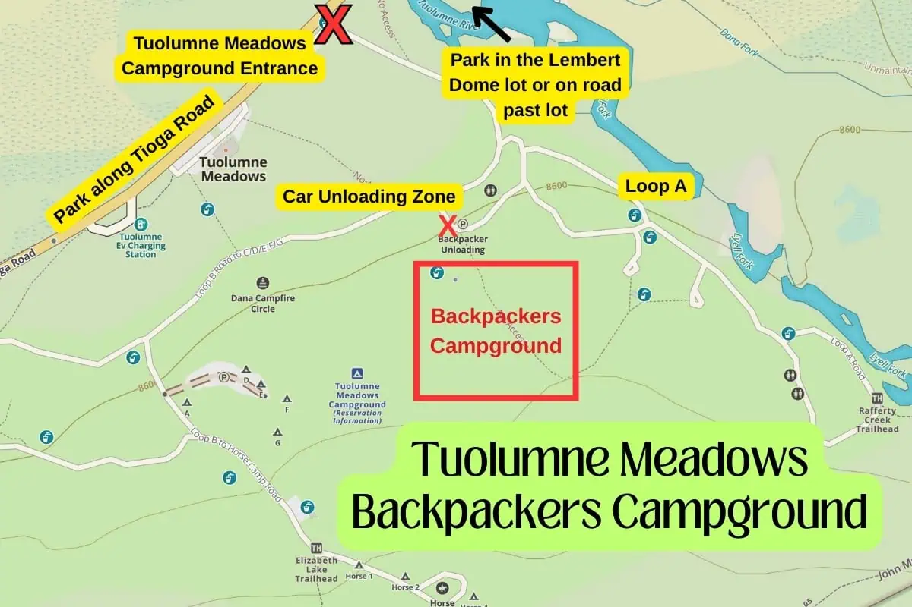
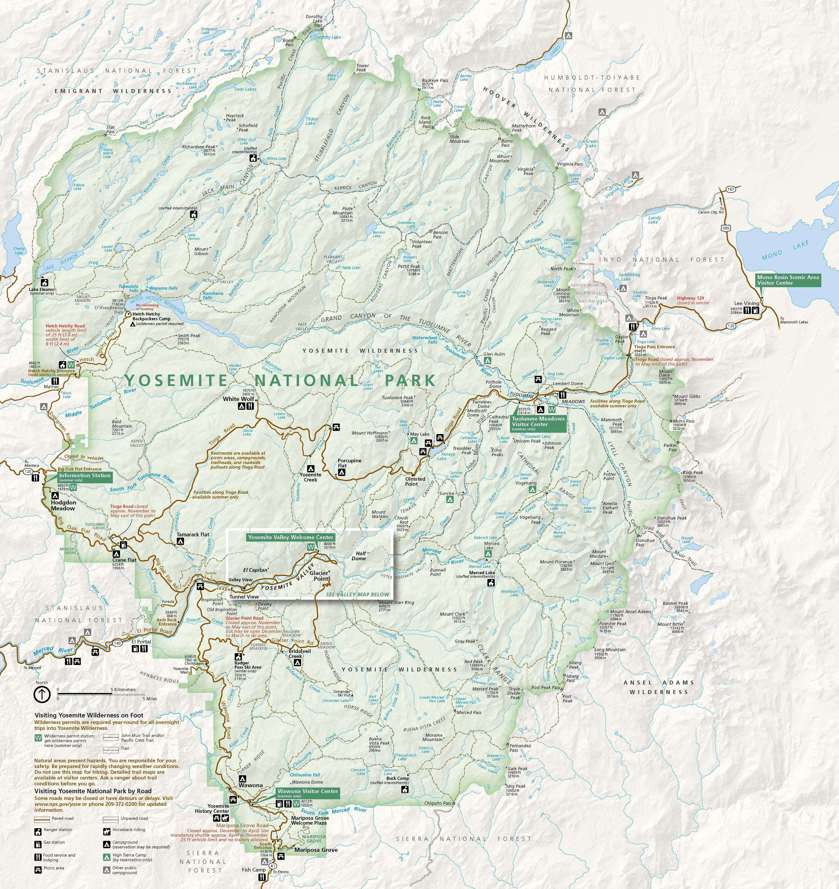
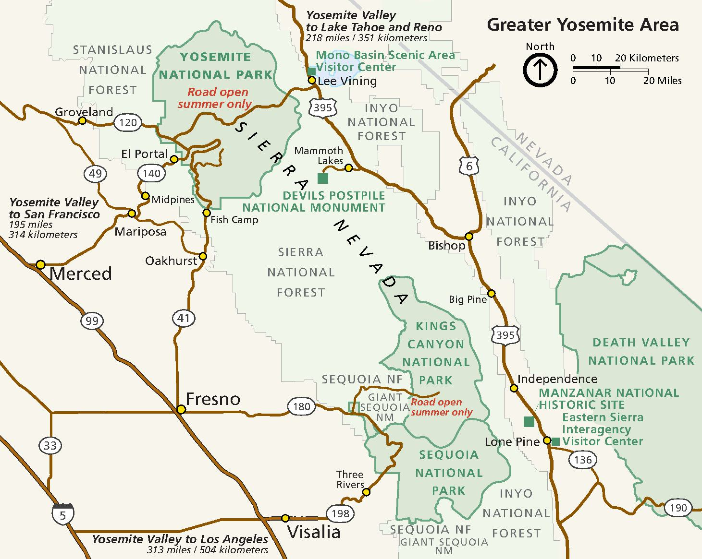

# Yosemite Fall 2025

Me and LT are doing it!



>The [Trip Site](https://tonygilkerson.github.io/yosemite2025/) contains a readonly copy of the Plan and supplementary material to be made available off-line

## Table of Contents

- [The Plan](#the-plan)
- [Lists](#lists)
- [Meals](#meals)
- [Flight](#flight)
- [Rental Car](#rental-car)
- [Hotel](#hotel)
- [Supplementary Material](#supplementary-material)
    - Reservation - Rafferty Creek to Vogelsang
    - [Permit Pickup](#permit-pickup)
    - [Official Hiking Itinerary](#official-hiking-itinerary)
    - [Food Storage](#food-storage)
    - [Current Conditions](#current-conditions)
    - [Public Transportation](#public-transportation)
    - [Backpackers Campgrounds](#backpackers-campgrounds)
    - [Tuolumne Meadows](#tuolumne-meadows)
    - [Contact](#contact)
    - [Maps](#maps)
    - [Estimating How Much Fuel](#estimating-how-much-fuel)
    - [Need to Get](#need-to-get)
    - [Search and Rescue Insurance](#search-and-rescue-insurance)
    - [How to Save This Document Off-line](#how-to-save-this-document-off-line)

---

## The Plan

### Plan Dates

| Trip<BR>Day | Day | Sep | Description           | Stay  |
| ----------- | --- | --- | --------------------- | ----- |
| 0           | Sat | 20  | Fly to LA             | Hotel |
| 1           | Sun | 21  | Drive to Yosemite     | BPC   |
| 2           | Mon | 22  | Hike 1 to Vogelsang   | HSC   |
| 3           | Tue | 23  | Hike 2 to Merced Lake | HSC   |
| 4           | Wed | 24  | Hike 3 to Sunrise     | HSC   |
| 5           | Thr | 25  | Hike 4 out            | BPC   |
| 6           | Fri | 26  | Drive to LA           | Hotel |
| 7           | Sat | 27  | Fly to Ohio           | Home  |

>**BPC** - Backpacker's Camp, The Valley<br>
>**HSC** - High Sierra Camp<br>

### Plan Day-by-Day

#### Trip Day 0 (Sat. Sep 20)

* Fly to LA, arrive around mid day
* Get rental car
* Go to dinner with LT
* Hotel, Santa Monica

#### Trip Day 1 - (Sun Sep 21)

* Up early and drive to Yosemite (~6hr) 
* Arrive around 3p so we have time to pick up our permit (station hours 8am to 5pm)
* Eat on the road, buy take-out dinner
* Pickup permit and find parking
* For dinner, we'll either buy food at a local store/restaurant or use the take-out we picked up earlier
* Camp at **The Valley Backpacker's Camp**

#### Trip Day 2 - (Mon Sep 22)

* Up early, eat breakfast in camp
* TODO - Ask ranger about water sources before we head out
* Hike, Lunch, Hike
* Arrive at **Vogelsang High Sierra Camp**
* Setup camp and have some dinner
* Optional
    * explore camp
    * check out the sky when it gets dark! (any/all nights)
  
#### Trip Day 3 - (Tue Sep 23)

* Up when we feel like it, breakfast, coffee enjoy the morning
* Hike, Lunch, Hike
* Arrive at **Merced Lake High Sierra Camp**
* Setup camp and have some dinner

#### Trip Day 4 - (Wed Sep 24)

* Up when we feel like it, breakfast, coffee enjoy the morning
* Hike, Lunch, Hike
* Arrive at **Sunrise High Sierra Camp**
* Setup camp and have some dinner

#### Trip Day 5 - (Thr Sep 25)

* Up when we feel like it, breakfast coffee enjoy the morning
* Hike, Lunch, Hike
* Arrive at **The Valley Backpacker's Camp**
* Setup camp and have some dinner

#### Trip Day 6 - (Fri Sep 26)

* Up when we feel like it, have some coffee and hit the road
* Eat on the road
* We can head to the Valley and be a tourist for a few hours, if we have the energy or just head to LA
* Hotel, Santa Monica

#### Trip Day 7 - (Sat Sep 27)

* Fly to Ohio

---

## Meals

| Trip<BR>Day | Day | Sep | Description           | Stay  | Meals Comment                       | Bfast | Lunch | Dinner |
| ----------- | --- | --- | --------------------- | ----- | ----------------------------------- | ----- | ----- | ------ |
| 0           | Sat | 20  | Fly to LA             | Hotel |                                     | OTR   | OTR   | OTR    |
| 1           | Sun | 21  | Drive to Yosemite     | BPC   | Stash 1-B and 1-D in car for return | OTR   | OTR   | OTR    |
| 2           | Mon | 22  | Hike 1 to Vogelsang   | HSC   | Store B, L and D in pack for today  | BFS-1 | SFP-1 | DFP-1  |
| 3           | Tue | 23  | Hike 2 to Merced Lake | HSC   |                                     | BFC-1 | SFC-1 | DFC-1  |
| 4           | Wed | 24  | Hike 3 to Sunrise     | HSC   |                                     | BFC-2 | SFC-2 | DFC-2  |
| 5           | Thr | 25  | Hike 4 out            | BPC   | D is stashed in the car             | BFC-3 | SFC-3 | DFS-1  |
| 6           | Fri | 26  | Drive to LA           | Hotel | B is stashed in the car             | BFS-2 | OTR   | OTR    |
| 7           | Sat | 27  | Fly to Ohio           | Home  |                                     | OTR   | OTR   | OTR    |

> * **B** - Breakfast
> * **S** - Snack/Lunch
> * **D** - Dinner
> * **FP (From Pack)** - Food stored in backpack, not in bear canister
> * **FC (From Canister)** - Food stored in bear canister<br>
> * **FS (Fro Stash)** - Food stashed in car so no need to carry.<br>

### Meal Counts

| Type | Description             | Count | People | Servings |
| ---- | ----------------------- | ----- | ------ | -------- |
| OTR  | On the road             |       |        |          |
| <hr> | <hr>                    | <hr>  | <hr>   |          |
| BFS  | Breakfast from pack     | 2     | 2      | 4        |
| BFC  | Breakfast from canister | 3     | 2      | 6        |
| <hr> | <hr>                    | <hr>  | <hr>   |          |
| SFP  | Snack from pack         | 1     | 2      | 2        |
| SFC  | Snack from canister     | 3     | 2      | 6        |
| <hr> | <hr>                    | <hr>  | <hr>   |          |
| DFP  | Dinner from pack        | 1     | 2      | 2        |
| DFC  | Dinner from canister    | 2     | 2      | 4        |
| DFS  | Dinner from stash       | 1     | 2      | 2        |

### Meal check list

* Trip Day 2 (Mon)

    - [x] BFS-1 Oats
    - [x] SFP-1 see Lunch
    - [x] DFP-1 Mushroom Pasta Alfredo

* Trip Day 3 (Tue)
    - [x] BFC-1 Oats
    - [x] SFC-1 see Lunch
    - [x] DFC-1 - Spiced Rice and Beans

* Trip Day 4 (Wed)
    - [x] BFC-2 Oats
    - [x] SFC-2 see Lunch
    - [x] DFC-2 - Tony's Spaghetti

* Trip Day 5 (Thr)
    - [x] BFC-3 Oats
    - [x] SFC-3 see Lunch
    - [x] DFS-2 Choice of
        - [x]  DFS-2.A - Black and White Rice and Beans
        - [x]  DFS-2.B - Hungry Hiker Stew

* Trip Day 6 (Fri)
    - [x] BFS-2 Oats

#### Lunch

* **LT Lunch (CCR)** - For my lunch I’m doing a what Im gonna call the CCR (crispy chicken rollup, not to be confused with Creedence Clearwater revival) Every day!

* **AEG Lunch** - You have 4 tortillas + peanut butter + all the snacks

#### Snacks

For snack we have:

- wheat things
- goldfish 
- trail mix
- protein bars
- granola bars
- jerky sticks for me
- cheese & cracker packs 

## Flight

AAdvantage Number: AAU1WW556
Username: my yahoo email address

AA Record Locator:   NDYCDZ
Status:   Ticketed - Aug 15, 2025

| Carrier           | Flight Number | Departing City  | Depart Date & Time    | Arriving City   | Arrive Date & Time    | Booking Code | Meals             |
| ----------------- | ------------- | --------------- | --------------------- | --------------- | --------------------- | ------------ | ----------------- |
| AMERICAN AIRLINES | 2486          | CMH Columbus    | Sep 20, 2025 05:55 PM | LAX Los Angeles | Sep 20, 2025 07:48 PM | B            | Food for purchase |
| AMERICAN AIRLINES | 2132          | LAX Los Angeles | Sep 27, 2025 09:31 AM | CMH Columbus    | Sep 27, 2025 05:04 PM | B            | Food for purchase |

| Passenger         | Class   | Seat Assignment |
| ----------------- | ------- | --------------- |
| ANTHONY GILKERSON | Economy | 29C             |

Traveling passengers may check in and obtain boarding passes for U.S. domestic electronic tickets within 24 hours of the flight time online at AA.com by using www.aa.com/checkin or at a Self-Service Check-In machine at the airport. Check-in options may be found [here](https://www.aa.com/i18n/plan-travel/extras/fares-and-trip-options.jsp). For information regarding American Airlines checked baggage policies, please visit [www.aa.com/baggageinfo](https://www.aa.com/baggageinfo).

Travelers must present a government-issue photo ID with either a boarding pass or a priority verification card at the security screening checkpoint

Please remember flight details are subject to change. In order to check a flight's status, gate, or departure and arrival time, go to www.aa.com and enter the flight information in the Gates and Times search area. In order to receive automatic notifications of flight changes, click on the Flight Status Notifications section on the www.aa.com homepage and enter the required flight and contact information.

## Rental Car

View [reservation on-line](https://view.e.budget.com/?qs=42ff083191e413439711aef4ded13bebea25363ea0699560808bf8794162a33e7b5d52e58cdfe37556322f3d9d398def3c7ed2e28cdef5264c7ca674871ed12812580b3399c1da0e6b0261a483f9ed5082f5bf66fa68d493)

### Renting at LAX

Budget Rental Car at LAX has moved to a new location at 
> 5251 W 98th Street, Los Angeles, CA 90045.

**Pickups**: Follow signs to the baggage claim area. Proceed outside and wait under the purple Car Rental Tram Stop Sign for the Avis/Budget/Payless courtesy bus to take you to the rental car facility

**Dropoffs**: Take Century Blvd to Concourse Way and follow the marked signs for Budget Rental Car Return.

```yaml
Confirmation Number: 31221753US3
Pick up: Sat Sep 20, 2025 at 07:00 PM
Drop off: Sat Sep 27, 2025 at 07:30 AM
Car: Kia Rio or similar or similar
Mileage: Unlimited free miles
Transmission: Automatic
```

| Item                             | Amount     |
| -------------------------------- | ---------- |
| **Estimated Total**              | $273.68    |
| **Amount Prepaid**               | USD$273.68 |
|                                  |            |
| Base Rate                        | $173.45    |
| Rental Options                   | $0.00      |
| Protections/Coverages            | $0.00      |
| Surcharges/Fees                  | $80.45     |
| Concession Recovery Fee (11.11%) | $20.28     |
| Customer Facility Fee 9.00/day   | $45.00     |
| Tourism Assessment Fee 3.50%     | $6.07      |
| Vehicle License Fee 1.30/day     | $9.10      |
| Taxes                            | $19.78     |

### Location Information

Pick Up Location

```text
Los Angeles Intl Airport,LAX
5251 W 98th St,
Los Angeles, CA 90045 US
(1) 310-642-4500 (0)
Sun - Sat open 24 hrs
```

Drop Off Location

```text
Los Angeles Intl Airport,LAX
5251 W 98th St,
Los Angeles, CA 90045 US
(1) 310-642-4500 (0)
Sun - Sat open 24 hrs
```

## Hotel

 Hotel, Santa Monica ([hotel.com](https://www.hotels.com/trips/72065320938766/details/MjM3NGVmMjItMzE2ZS02MGUzLTkxZTktZDU3ZmY2YTAyN2U1O2UxMzZmYzRlLWIwOTMtNDQ2OC04NWNkLWI3MTk0M2Q1ZTU3OV8wOzA?siteid=300000001&EMLCID=HCOM-US.TRC.ACTV.2d3d033161682fd9668bed9f3714038c.EML&EMLDTL=DATE20250815-LANGEN_US.TEST496.VERS3.CAT02G255.MOD666184&cta=genericNotification.HCom_Itinerary_V1.link&rfrr=AB.5037.1))

### First Stay

```yaml
Itinerary: 72065320938766

Check in: Sat, Sep 20, 3pm
Check out: Sun, Sep 21, 11am

Location: 12311 Santa Monica Blvd, Los Angeles, CA, 90025
```

### Second Stay

```yaml
Reservation Confirmation No: 2269013461

Check in: Friday, Sep 26, 3pm
Check out: Saturday, Sep 27, 11am

Luggage Storage: Available for guests checking in beginning at 12 PM and for departing guests until 2 PM.

Parking: We offer a limited amount of parking spaces in our garage. Due to limited capacity, the spots are first come-first serve at an inclusive rate of $33.00 per night. For more details, contact or visit Guest Services at +1 (213) 952-7869

Location: 12311 Santa Monica Blvd, Los Angeles, CA, 90025
```

---

## Pack List

### AEG Pack

* Core Gear
    * Backpack
    * Tent - 2P Tent
    * Ground tarp/footprint
    * Sleeping bag (summer bag and extra one for on top)
    * Sleeping pad (Big Agnes Rapide SL)
    * Bear Canister (BV450 Jaunt)
    * Headlamp - Petzl Tikka Headlamp with charging cord
* Electronics
    * iPhone w/offline maps and info and charging cord
    * Backup iPhone w/offline maps and info and charging cord
    * EarPods and charging cord
    * USB power pack
    * Sunjack Solar Panels
* Food
    * Stove - Zip 0.8 L Fast Boil System
    * IsoPro Fuel Canister - TODO how many
    * pot
    * utensel
* Clothing
    * Rain Jacket - REI XeroCloud 3L
    * Vest - 650 Down Vest
    * Long Sleeves Shirt - Swiftland Thermal Running Crew Pullover
    * Short Sleeves Shirt (2)
      * Swiftland Running T-Shirt
      * Other
* meds
    * Tylenol
    * IB-pro-fin
    * Statan
* First Aid

### LT Pack

* Core Gear
    * Backpack
    * Sleeping bag (Heimlich)
    * Sleeping pad (TODO)
    * Bear Canister (BV425 Jaunt)
    * Headlamp - w/extra batteries (TODO find my old one)
    * cards and dice
* Electronics
    * iPhone w/offline maps and info
    * EarPods and charging cord
    * USB power pack and charging cords
* Clothing
    * Rain Jacket
* food and water
    * Camel back
    * nalgene 

---

## Supplementary Material

### Reservation - Rafferty Creek to Vogelsang

> [Reservation #0745333876-1](https://www.recreation.gov/account/orders/0745333876/reservations/7c8009d3-0cb3-4171-9fe2-d2b658c97ffb__445859)

### Permit Pickup

You must pick up your permit in person at any open [Yosemite Wilderness Permit Station](https://www.nps.gov/yose/planyourvisit/permitstations.htm) (stations open seasonally, not limited to your listed issuing station) the day before, or the day of your permit entry date. You must pick up your permit by 11:00 a.m. on your entry date or place it on hold for late pick-up, or it will be cancelled. To place your permit on hold, log in to your recreation.gov account to modify your permit reservation and mark it for late pick-up once you are within one week of your entry date.

* **Yosemite Valley Wilderness Center** - The Yosemite Valley Wilderness Center is located at the Yosemite Valley Welcome Center in Yosemite Village, near the Village Store complex
    * Coordinates: 37.74844, -119.58662

* **Tuolumne Meadows Wilderness Center** - **CLOSED** is located just off the Tioga Road in Tuolumne Meadows. It is about one mile east of the visitor center. From the Tioga Road, follow signs for Tuolumne Meadows Lodge, Dog Lake, and Wilderness Permits. Parking is available at the wilderness center.
    * **Coordinates**: 37.87695, -119.34626

### Official Hiking Itinerary

We start from `Rafferty Creek->Vogelsang`, this trail follows the Lyell Fork of the Tuolumne River through sub-alpine meadows and then climbs along Rafferty Creek to Tuolumne Pass, Vogelsang, and destinations beyond!

Travel at least four miles from Tuolumne Meadows before finding allowable camping. There is no longer a toilet at the backpacker sites at Vogelsang. If staying at backpacker sites near Fletcher Lake, please disperse several hundred feet from the campground boundary when going to the bathroom. Fires are prohibited in the Vogelsang area, at Boothe Lake, and above 9,600 feet. Along the Tuolumne Watershed, ensure all washing and waste is 300' from water.

Half Dome available with this trail head. All members of the permit are eligible to walk up Half Dome. Additional fees of $10 per person due when permit is issued.

> **TODO** - LT needs to prep here iPhone as a backup. She will need:
> * an offline copy of this doc
> * the Recreation.gov app, (with her login or mine?)
> * onX with our Yosemite trip downloaded into "off-line maps" Not sure if she can use my account, or she should just pay for a year, and when I see she I mean me :-)

### Food Storage

Bear-Resistant Food Storage is required for all overnight stays in Yosemite Wilderness. Bear canisters are available for rent at a Yosemite Wilderness Permit Station for $5 per week (deposit required).

Certain bear-resistant portable containers designed for backpackers to store food are allowed for use in Yosemite (however, only the Garcia Backpackers' Cache 812 is available for rental in Yosemite).  

>See [allowed containers](https://www.nps.gov/yose/planyourvisit/containers.htm)

### Current Conditions

Before you go Check [Current Wilderness Conditions](https://www.nps.gov/yose/planyourvisit/wildcond.htm) for trail conditions and timely updates, and read the [Yosemite Backpacking page](https://www.nps.gov/yose/planyourvisit/backpacking.htm).

#### Weather Forcast

* See the [Weather Map](https://www.nps.gov/yose/planyourvisit/weathermap.htm)

#### Tioga Road and Tuolumne Meadows (As of Sep 3)

* Dingley Creek is dry. Delaney Creek is low flow but still running. Water is plentiful in Spiller, Return, and McCabe creeks. Water is still to be found in Cold Canyon.
* Rafferty Creek is dry.
* The Grand Canyon of the Tuolumne is hot. Creeks can be crossed dry. Small flies are abundant in some sections. Be aware of rattlesnakes. Morrison Creek has a slow flow. The trail is clear of fallen logs.
* No water available at Sunrise backpackers campground. Water is available in Sunrise Creek along the JMT.
* The bridge southeast of Washburn Lake over the Merced River is out. An accessible crossing is 20 feet downstream. The crossing is 35 feet across and two feet at its deepest with a gentle current.
* PCT hikers are not eligible for side trips to Yosemite Valley without an additional permit.
* The Tuolumne Meadows Visitor Center, Post Office, Grill, and Lodge are open. Tuolumne Meadows Backpackers Campground is open but will close this month.
* White Wolf Backpackers Campground is open with portable toilets. Carry in your own drinking water.
* Yosemite Creek Campground has closed for the season so backpackers must start hiking from Tioga Road.

### Public Transportation

Explore Public Transportation Options for going to and getting around Yosemite National Park.

* [YARTS](https://www.yarts.com/) - For inside the park
* [Public Transportation](https://www.nps.gov/yose/planyourvisit/publictransportation.htm) - Such as Amtrak and Greyhound if we want to travel from one of the surrounding areas.

### Backpackers Campgrounds

[Backpackers campgrounds](https://www.nps.gov/yose/planyourvisit/bpcamp.htm) (open seasonally) are available for wilderness permit holders to spend one night before and one night after a wilderness trip. **Reservations are not required nor necessary**.

The fee is $8 per person. Download the **Recreation.gov mobile app** now and use the *Scan & Pay* feature onsite (even if you don't have internet access at the campground). Parking is not available at campgrounds; instead park at designated overnight parking areas and walk to the backpackers campground.

#### Tuolumne Meadows (CLOSED)

[Tuolumne Meadows Campground](https://www.nps.gov/yose/planyourvisit/tmcamp.htm)'s major rehabilitation project is nearly complete; the campground is planned to reopen in 2025 (eta Aug??). Each campsite is near a bathroom with drinking water and flushing toilets. The group sites have five food lockers. See [Opening, Closing, and Reservation Updates](https://www.nps.gov/yose/planyourvisit/campgrounds.htm#updates) for last minute deets, or call the Tuolumne Meadows campground office at (209) 372-4025.

If you are hiking through Tuolumne Meadows, you must camp at least four trail miles from Tuolumne Meadows.

#### Yosemite Valley

> Coordinates: 37.74542, -119.56715

The backpackers campground is behind North Pines Campground (and across the footbridge). It is open the same dates as North Pines, mid-April through early-October (approximately); camping in the campground is only allowed when it is open. If arriving at night, please be quiet as you unload your car in the unloading zone and walk to the campground. This campground has vault toilets and no drinking water (drinking water is available nearby in North Pines Campground).

Collecting wood is not allowed in Yosemite Valley. Campfires are only allowed from 5 pm to 10 pm, May through September.

While you may park for 15 minutes at the entrance to the backpackers campground (in North Pines Campground) to unload your gear, park overnight at the trail head parking or at Curry Village parking. (Overnight parking is not available at The Ahwahnee.)

### Contact

* **Preferred**: If you have other questions about reservations please fill out [this form](https://yosemite.org/contact-us/) and we will get back to you within two business days.

* For assistance with your reservation, call `209-372-0740` (Monday through Friday, 9:00 a.m. to 4:00 p.m.).

* If you have general questions about Yosemite Wilderness, call `209-372-0826` (Monday through Friday, 9:00 a.m. to 4:30 p.m.). This number is generally staffed between early May and mid October. 

* If you have wilderness questions (e.g., hiking Half Dome and backpacking), you can call `209/372-0826`, Monday through Friday (9 am to noon and 1 to 4:30 pm) to speak to a wilderness ranger. This phone is in service from May through September.

### Maps

#### Yosemite Wilderness Trailheads

[Yosemite Wilderness Trailheads (pdf)](pdf/yosemite-wildernesstrailheads.pdf)

#### Yosemite Valley

Detail map



#### Tuolumne Meadows

For more detail information see [Tuolumne Meadows Campground](https://www.nps.gov/yose/planyourvisit/tmcamp.htm)



Camp





#### Yosemite Park Map



#### Yosemite Area Map



### Estimating How Much Fuel

For more detail see [this REI Expert Advice article](https://www.rei.com/learn/expert-advice/how-much-stove-fuel-should-i-take-on-my-backpacking-trip.html)

To get a ballpark estimate I am going to count the boils needed. For example, for breakfast I will need two boils, one for coffee and one for oats.  For dinner I will also need two boils one for food hydration and a second for cooking time.

>Assume: 4 boils per person per day (`4b`)

For fuel I plan to use the small 100g cans.  According to the REI article noted above you can get ~12 boils. I am going to round that down to 10 to be safe.

>Assume: 10 boils per can (`10pbd`)

Doing the math for two people (`2p`) and five days (`5d`), the two stays in the backpacker's camp count as a half day. So that is 4 full days and two half days for a total of five days.

```eq
number of cans = (2p * 5d * 4b) / 10bpd = 4
```

> We need `4` 100g cans

### Need to Get

* **First day breakfast + lunch**: 
    * bread
    * (2) mini bags of chips
    * (2) bananas
    * cheese
    * veggie meat
    * PB
    * Jelly
* **Oatmeal add-ins**: cranberries + PB? 
* **Lunch protein/Main**:
    * tuna creations (lauren only)
    * chicken creations  (lauren only)
    * PB & J
* **Lunch crispies/crackers**:
    * goldfish
    * cheeze-its
    * other crackers??
* **Condiments**?: mustard + mayo packets
* **Drinks**: Electrolytes, Hot cocoa, tea
* **Snacks**: (options below - won’t bring everything...obviously)
    * Trail mix (work)
    * Protein bars (work)
    * Stinger waffles?
    * Running gummies/salt pills?
    * Dried fruit?
    * Chocolate?
* One dessert? :)

### Search and Rescue Insurance

* **Learn About Your Plan** - Visit the [Support Center](https://support.garmin.com/en-US/) to browse resources including articles, videos, owner's manuals and more.

* **Contact Garman** - For questions regarding SAR plans, contact the Customer Service & Billing Team at `1-888-460-4554` or `plan-support@garmin.com`.

* **Document** - [SAR Insurance Documents](https://subscriptions.garmin.com/legal/insurance/sar)

Plan Details

```yaml
Plan name: SAR 100 Search and Rescue Insurance Plan
Account number: DL3296962
Plan term: 12 months
Start date: 9/11/2025
Annual plan fee: $39.95 USD
Insured individual: Anthony Gilkerson
Beneficiary: Teresa Gilkerson
Renewal date: 9/11/2026.
```

### Visitor Centers & Museums

Visitor center and museums in the Yosemite Valley

* **Yosemite Valley Welcome Center** (located next to Village Store, open all year): Ranger-staffed information desk and bookstore, informational and directional exhibits.

* **Yosemite Exploration Center**, formerly Valley Visitor Center (opening Fall 2023): Spirit of Yosemite film, and exhibit areas detailing the park's geology, plant and animal life, history, rock climbing, and more.

* **Yosemite Museum** (open all year): The Indian Cultural Exhibit and Village interprets the cultural history of Yosemite's traditionally associated tribes from 1850 to the present. Demonstrations of traditional skills are presented. The Gallery offers art exhibits periodically throught the year.

* **Valley Wilderness Center** (May to October): Offers wilderness permits, bear canisters, maps, and guidebooks. Information on pre-trip planning, minimum-impact camping, and the Yosemite Wilderness.

* **Happy Isles Art and Nature Center** (May to September): Designed for nature-exploring families, this center offers natural history exhibits, interactive displays, and art workshops. Nearby are short trails through the area’s forest, river, and fen environments. Evidence of the huge 1996 rockfall from the Glacier Point cliff is visible above.

* **Yosemite Conservation Heritage Center**, formerly LeConte Memorial Lodge (late May to early September): Yosemite's first public visitor center, operated by the Sierra Club, features a children's corner, library, and a variety of environmental education and evening programs.

### How to Save This Document Off-line

**Prepare Content**

* In onX, click the `Share [^]` icon for a waypoint, copy the link and use it in a hyper link in markdown. Below is an example.

    [Lembert Dome Trailhead Waypoint](https://webmap.onxmaps.com/backcountry/share/content?share_id=01JXT0PAM2MYDRQ27SP4ZVG0C2)

**Create Web Archive**

* Using Safari navigate to [this page](https://notebook.tonygilkerson.us/outside/backpacking/yosemite-fall-2025/)
* From the menu bar at the top choose "save as"
* Make sure the type is "Web Archive"
* Give the file a good name and store it in the iCloud under the Yosmite folder

**Save Offline**

* Using the Files app on your iPhone, download said file
* Now you can view the web page off-line
